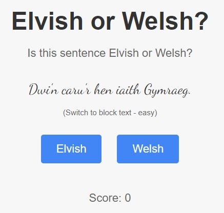

# Elvish or Welsh?
**https://djsaunders1997.github.io/elvish-or-welsh/**

This is a simple web-based game that lets players guess whether a sentence is Elvish (Sindarin) or Welsh.

## Background

When JRR tolkien created Elvish he based it heavily on Welsh, and other Celtic languages [source](https://en.wikipedia.org/wiki/Sindarin).
Meaning that Elvish and Welsh can look quite similar, especially to those unfamiliar with either language.

## How to Play

1. Visit the game website: https://djsaunders1997.github.io/elvish-or-welsh/
2. Read the displayed sentence.
3. Click on the "Elvish" or "Welsh" button to make your guess.
4. Your score will be updated based on your correct guesses.

## Technologies Used

- HTML
- CSS
- JavaScript
- ChatGPT 👀️
- Google Analytics (tracks only page views and no user info)

## Files
- index.html: the HTML file for the game website.
- style.css: the CSS file for styling the game website.
- app.js: main file initializing the game and setting up the required elements, event listeners, and game state.
- gameLogic.js: core game logic file, which includes functions for checking answers, updating the font style, and other game-related functionalities.
- sentences_json.js: contains the sentences data in JSON format, which is parsed and shuffled before being exported. This file also contains a function to shuffle the sentences array.

## Contributions

If you'd like to contribute to the project, feel free to submit a pull request or open an issue on GitHub. I welcome any suggestions or improvements.

## License

This project is licensed under the MIT License. See the [LICENSE](LICENSE) file for details.

## Author

David Saunders - [GitHub](https://github.com/DJSaunders1997)
